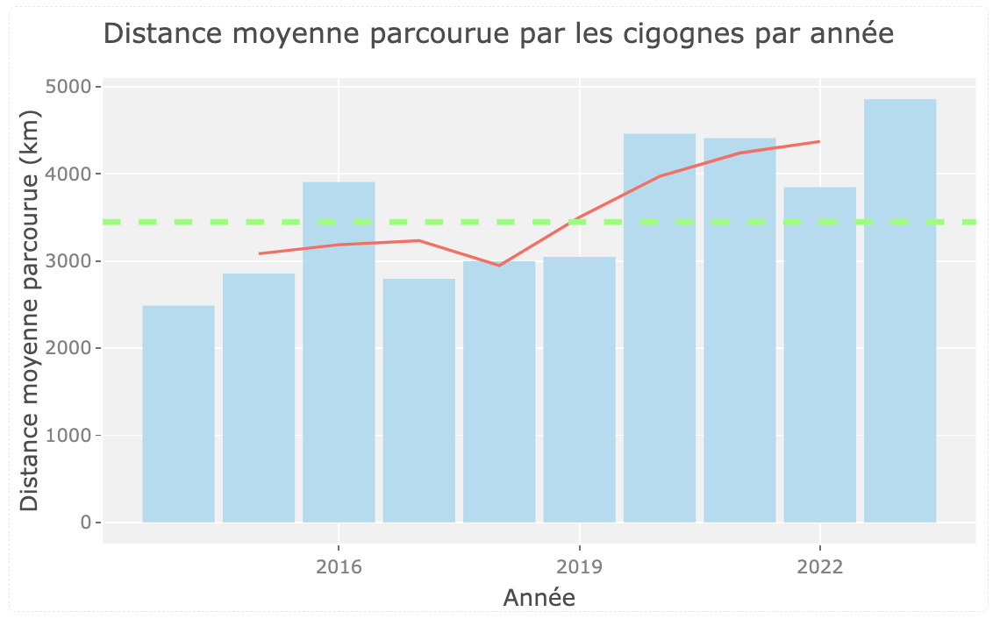

```{r setup, include=FALSE}

library(flexdashboard)
library(shiny)
library(leaflet)
library(ggplot2)
library(plotly)
library(dplyr)
library(DT)
library(leaflet.extras)
library(leaflet.providers)
library(lubridate)
library(zoo)

caribou_temp_alt <- read.csv("location_with_temperature_altitude.csv")
caribou <- read.csv("caribou.csv")
caribou_all <- read.csv("locations.csv")
# Convert timestamp to proper date format
caribou_all$timestamp <- ymd_hms(caribou_all$timestamp)

cigogne_big <- read.csv("data_nettoyee_V1.csv",sep=";")
cigogne <- read.csv("cigogne.csv")

# Fonction pour calculer la distance entre deux points géographiques
distance_between_points <- function(longitude, latitude) {
  # Convertir les coordonnées en radians
  lon1 <- longitude[-length(longitude)] * pi / 180
  lon2 <- longitude[-1] * pi / 180
  lat1 <- latitude[-length(latitude)] * pi / 180
  lat2 <- latitude[-1] * pi / 180
 
  # Calculer la distance entre les points avec la formule de la distance orthodromique
  d <- 6371 * acos(sin(lat1) * sin(lat2) + cos(lat1) * cos(lat2) * cos(lon2 - lon1))
 
  # Retourner la distance en kilomètres
  return(d)
}

# Fonction pour générer une couleur aléatoire 
generate_random_color <- function() {
  # Générer des valeurs RGB aléatoires entre 0 et 255
  red <- sample(50:255, 1)
  green <- sample(50:255, 1)
  blue <- sample(50:255, 1)
  # Construire la couleur au format hexadécimal
  color <- rgb(red, green, blue, maxColorValue = 255)
  return(color)
}

#Garder que les Animaux avec plus qu'une occurence + enlever les lignes avec des NA

caribou_temp_alt <- na.omit(caribou_temp_alt)
animal_id_counts <- table(caribou_temp_alt$animal_id)
caribou_temp_alt <- caribou_temp_alt[caribou_temp_alt$animal_id %in% names(animal_id_counts[animal_id_counts > 1]), ]

#Garder que les Animaux avec plus qu'une occurence + enlever les lignes avec des NA
cigogne <- na.omit(cigogne)
animal_id_counts <- table(cigogne$nom)
cigogne <- cigogne[cigogne$nom %in% names(animal_id_counts[animal_id_counts > 1]), ]

```

# 🏠 Présentation

Column {data-width=450}
-------------------------------------
### Contexte

  Le réchauffement climatique devient une préoccupation majeure ces dernières années, d’autant plus qu’il impacte fortement la conservation et l’environnement de certaines espèces animales. L’étude des comportements migratoires des animaux est un domaine de plus en plus étudié par les professionnels afin d’aider à la sauvegarde des espèces animales et végétales en relevant les facteurs externes qui tendent à bouleverser et impacter le plus les écosystèmes et animaux. Parmi eux, l’élévation constantes des températures, causée par le réchauffement climatique, et leurs variations intenses peuvent être à l’origine de changements de comportement des espèces animales qui s’adaptent à un nouvel environnement

  Nous nous intéresserons donc ici aux changements d’habitudes migratoires, potentiellement impactée par la température sur une quinzaine d’années de deux espèces menacées et en voie d’extinction : le caribou des bois (écotype montagnard) et la cigogne blanche européenne.
  
  L’objectif premier sera donc de démontrer une corrélation entre les variations des températures annuelles dans les zones de migrations connues et la distance parcourue par ces animaux pendant leur période de migration, ainsi que leur période de migration.


Column {data-width=550}
-------------------------------------

### Objectif et Problématique

Dans cette étude, nous analyserons donc l’évolution de la distance moyenne et de l’altitude moyenne (quand cela est pertinent) des trajets de migration des animaux au fil des saisons et au fil des années. Nous souhaitons notamment mettre en lumière les potentiels changements de comportements des animaux (allongement des périodes de migration, distances de migration réduites…) au fils des ans, ce qui pourrait être relié entre autre à des changements de température.


### Collecte de données

  Pour cette étude, nous avons utilisé la banque de données Movebank. Cette dernière dont nous avons scrappé les données GPS de nos animaux est une database gratuite hébergée par l’Institut Max Planck qui étudie les comportements des animaux. Nous avons aussi utilisé l’API d’Open Archive météo pour récupérer les températures sur les 30 dernières années des zones de migrations de la cigogne et du caribou. Nous avons par la suite dû traiter près de 1 million de données pour les caribous et près de 12 millions de données pour les cigognes juste pour récupérer les coordonnées GPS des animaux et pouvoir les afficher de manière simple. En effet, les données GPS que nous avions collectées sont issues de données de télémétries d’animaux baguées, qui enregistrent la position de l’animal toutes les 2min durant plusieurs années consécutives. 

  Grâce au traitement des données, nous avons ainsi pu analyser le trajet de migration de 150 cigognes et de 170 caribous sur une période d’environ 15 ans chacune.
  
  Etant donné que récupérer et afficher les températures sur les trentes dernières années sur des zones étendues n’est pas réalisable, nous avons choisis des points spécifiques gps par où passent les animaux et la date à laquelle ils y sont passés. 

### Fait Par

- Lena Connesson
- Safae Elkhaoui
- Lucie Legarez
- Marc Cheng
- Omar Benouahi


# 📊 Données Finales

Column {.tabset data-width="750"}
-----------------------------------------------------------------------

### Caribou

```{r}
datatable(caribou, options = list(pageLength = 25, dom = 'Bfrtip', buttons = c('csv')) ,extensions = 'Buttons')
```

### Cigogne

```{r}
datatable(cigogne, options = list(pageLength = 25, dom = 'Bfrtip', buttons = c('csv')),extensions = 'Buttons')
```

### Remarque

<div style="margin-left: 20px; margin-right: 20px;">
 <p style="font-size: 16px; line-height: 1.5;"> 
Pour optimiser les performances du dashboard et accélérer le traitement des données, nous avons dû réduire le nombre de données initiales. Pour ce faire, nous avons adopté une approche consistant à agréger les données pour chaque mois, plutôt que de conserver chaque point de données individuel. Ainsi, au lieu de traiter 30 ou 31 points de données par mois, nous avons calculé la moyenne des données pour chaque mois, ce qui a considérablement réduit le volume de données à gérer qui était (70 000 Pour les cigognes et 122900 pour les caribous).
 </p>
 <p style="font-size: 16px; line-height: 1.5;"> 
Cette méthode nous a permis de ramener le nombre de données à environ 5500 pour les Caribous et 2600 pour les cigognes. De plus, pour les données de température, nous avons utilisé une API météo via un script Python (voir <a href="https://drive.google.com/drive/u/2/folders/1M5tVUmKraY0MBubz-rMw8xOXievDtkMX" target="_blank">ce lien</a> pour plus de détails). Enfin, pour l'altitude, nous avons fait appel à une bibliothèque R dédiée.
 </p>
</div>
 
 
# 🗺️ Analyse des trajets

Column {.tabset data-width="750"}
-----------------------------------------------------------------------

### Caribou

```{r}
# Configuration de l'interface utilisateur
ui <- fluidPage(
  titlePanel(
    HTML("<span style='color: black; font-size: 30px; font-family: Cursive; font-weight: bold;'>Analyse des trajectoires de migration des caribous</span>")
  ),
  sidebarLayout(
    sidebarPanel(
      radioButtons("analysis_choice", HTML("<span style='color: #8B0000;'>Choix d'analyse :</span>"), 
                   choices = c("Analyser un caribou" = "single", "Comparer plusieurs caribous" = "multiple"), 
                   selected = "single"),
      
      tags$hr(class = "custom-hr"),
      
      conditionalPanel(
        condition = "input.analysis_choice == 'single'",
        selectInput("caribou_id_single", HTML("<span style='color: #8B0000;'>Sélectionner un caribou :</span>"), 
                    choices = sort(unique(caribou_temp_alt$animal_id)))
      ),
      conditionalPanel(
        condition = "input.analysis_choice == 'multiple'",
        selectizeInput("caribou_id_multiple", HTML("<span style='color: #8B0000;'>Sélectionner un ou plusieurs caribous :</span>"), 
                       choices = sort(unique(caribou_temp_alt$animal_id)), multiple = TRUE)
      ),
      
      tags$hr(class = "custom-hr"),
      
      checkboxGroupInput("show_options", HTML("<span style='color: #8B0000;'>Options d'affichage :</span>"), 
                         choices = list("Afficher la trajectoire" = "trajectory",
                                        "Afficher les positions" = "positions")),
      
      tags$hr(class = "custom-hr"),
      
      uiOutput("date_ui"),
      checkboxGroupInput("migration_options", HTML("<span style='color: #8B0000;'>Paramètres de migration :</span>"), 
                         choices = list("Température" = "temperature",
                                        "Altitude" = "altitude"),
                         selected = "Température"),
      
      conditionalPanel(
        
        condition = "input.migration_options.includes('altitude')",
        radioButtons("altitude_display_option", HTML("<span style='color: #8B0000;'>Affichage de l'altitude :</span>"), 
                     choices = c("Carte en relief" = "altitude_map",
                                 "Marqueurs d'altitude" = "altitude_markers"),
                     selected = "altitude_map"),
        
      )
    ),
    mainPanel(
      # Utilisation de la classe "style" pour définir la taille de la carte
      leafletOutput("migration_map", width = "100%", height = "600px")
    )
  ),
  tags$style(type = "text/css", "#migration_map { padding: 0px; margin: 0px; }"),
  tags$style(
    type = "text/css",
    HTML("
  .custom-hr {
    border: none; /* Supprimer la bordure */
    height: 1px; /* Hauteur de la ligne */
    background-color: black; /* Couleur de la ligne */
    margin: 25px 0; /* Marge au-dessus et en dessous de la ligne */
  }
")
  ),
)


#Configuration du server
server <- function(input, output, session) {
  
  output$date_ui <- renderUI({
    req(input$show_options)
    if ("positions" %in% input$show_options && "single" %in% input$analysis_choice){
      caribou_data <- get_selected_caribou_data(input)
      caribou_dates <- unique(caribou_data$timestamp)
      
      sliderInput("date_slider", "Sélectionner une date :", 
                  min = min(as.Date(caribou_dates)),
                  max = max(as.Date(caribou_dates)),
                  value = min(as.Date(caribou_dates)))
      
    } else if ("positions" %in% input$show_options && "multiple" %in% input$analysis_choice){
      
      if ("positions" %in% input$show_options && !is.null(input$caribou_id_multiple)) {
        
        caribou_data <- get_selected_caribou_data(input)
        caribou_dates <- unique(caribou_data$timestamp)
        
        sliderInput("date_slider", "Sélectionner une date :", 
                    min = min(as.Date(caribou_dates)),
                    max = max(as.Date(caribou_dates)),
                    value = min(as.Date(caribou_dates)))  
      } else {
        NULL
      }
    } else {
      NULL
    }
  })
  
  output$migration_map <- renderLeaflet({
    caribou_data <- get_selected_caribou_data(input)
    
    map <- leaflet() %>%
      addTiles() %>%
      addScaleBar(position = "bottomleft")
    
    if ("altitude" %in% input$migration_options) {
      if (input$altitude_display_option == "altitude_map") {
        map <- clearTiles(map) %>%
          addProviderTiles(providers$OpenTopoMap)
      } else if (input$altitude_display_option == "altitude_markers") {
        map <- add_caribou_elevation_map(map, caribou_data)
      }
    }
    
    if ("trajectory" %in% input$show_options) {
      map <- add_caribou_trajectories(map, caribou_data)
    }
    
    if ("positions" %in% input$show_options) {
      map <- add_caribou_positions(map, caribou_data, input$date_slider)
    }
    
    if ("temperature" %in% input$migration_options) {
      map <- add_caribou_heatmap(map, caribou_data)
    }
    
    map <- add_caribou_legend(map, caribou_data)
    
    map
  })
}


# Fonction pour calculer les limites des températures pour chaque caribou
calculate_temp_limits <- function(caribou_data) {
  if (nrow(caribou_data) == 0) {
    return(c(0, 0))
  } else {
    min_temp <- min(caribou_data$temperature) - 0.01
    max_temp <- max(caribou_data$temperature) + 0.01
    return(c(min_temp, max_temp))
  }
}


# Fonction pour créer une palette de couleurs personnalisée pour les températures
create_custom_palette <- function(n) {
  colors <- colorRampPalette(c("blue", "green", "yellow", "orange", "red"))(n)
  return(colors)
}


# Fonction pour ajouter la carte des températures
add_caribou_heatmap <- function(map, caribou_data) {
  temp_limits <- calculate_temp_limits(caribou_data)
  min_temp <- temp_limits[1] 
  max_temp <- temp_limits[2] 
  
  breaks <- seq(min_temp, max_temp, length.out = 5)  
  normalized_temps <- (caribou_data$temperature - min_temp) / (max_temp - min_temp)
  
  color_palette <- create_custom_palette(100)
  colors <- color_palette[findInterval(normalized_temps * 100, seq(0, 100))]
  
  map <- addCircleMarkers(map, lng = caribou_data$longitude, lat = caribou_data$latitude,
                          radius = 5, color = colors, fillOpacity = 0.7)
  
  map <- addLegend(map = map, pal = colorNumeric(palette = color_palette, domain = breaks),
                   values = breaks, position = "bottomright", title = "Température (°C)",
                   opacity = 0.5)
  map
}


# Fonction pour calculer les limites de l'altitude pour chaque caribou
calculate_elevation_limits <- function(caribou_data) {
  if (nrow(caribou_data) == 0) {
    return(c(0, 0))
  } else {
    min_elevation <- min(caribou_data$elevation)
    max_elevation <- max(caribou_data$elevation)
    return(c(min_elevation, max_elevation))
  }
}


# Fonction pour créer une palette de couleurs personnalisée pour l'altitude
create_elevation_palette <- function(n) {
  colors <- colorRampPalette(c("white", "black"))(n)
  return(colors)
}


# Fonction pour ajouter la carte de l'altitude
add_caribou_elevation_map <- function(map, caribou_data) {
  elevation_limits <- calculate_elevation_limits(caribou_data)
  min_elevation <- elevation_limits[1]
  max_elevation <- elevation_limits[2]
  
  breaks <- seq(min_elevation, max_elevation, length.out = 5)
  normalized_elevation <- (caribou_data$elevation - min_elevation) / (max_elevation - min_elevation)
  reversed_normalized_elevation <- 1 - normalized_elevation
  
  elevation_palette <- create_elevation_palette(100)
  colors <- elevation_palette[findInterval(reversed_normalized_elevation * 100, seq(0, 100))]
  
  map <- addCircleMarkers(map, lng = caribou_data$longitude, lat = caribou_data$latitude,
                          radius = 10, color = colors, fillOpacity = 0, weight = 5)
  
  map <- addLegend(map = map, pal = colorNumeric(palette = elevation_palette, domain = breaks),
                   values = breaks, position = "bottomleft", title = "Altitude (°m)",
                   opacity = 0.5)
  map
}


# Fonction pour obtenir les données du caribou sélectionné
get_selected_caribou_data <- function(input) {
  if (input$analysis_choice == "single") {
    subset(caribou_temp_alt, animal_id == input$caribou_id_single)
  } else {
    subset(caribou_temp_alt, animal_id %in% input$caribou_id_multiple)
  }
}


# Fonction pour ajouter les positions des caribous à la carte pour une date spécifique
add_caribou_positions <- function(map, caribou_data, date) {
  num_caribous <- length(unique(caribou_data$animal_id))
  if (num_caribous > 1) {
    colors <- rainbow(num_caribous)
  } else {
    colors <- "red"
  }
  caribou_ids <- unique(caribou_data$animal_id)
  
  for (i in 1:num_caribous) {
    caribou_data$timestamp <- as.Date(caribou_data$timestamp)
    caribou_subset <- subset(caribou_data, animal_id == caribou_ids[i] & timestamp == date)
    if (nrow(caribou_subset) > 0) {
      map <- map %>%
        addMarkers(data = caribou_subset, lng = ~longitude, lat = ~latitude,
                   popup = ~paste("<b>Identifiant :", animal_id, "</b> <br>Latitude :", latitude, "<br>Longitude :", longitude, "<br>Température :", temperature, "°C", "<br>Altitude :", elevation, "m" )) # Utilisation de la couleur correspondant à chaque caribou
    }
  }
  map
}


# Fonction pour ajouter les trajectoires des caribous
add_caribou_trajectories <- function(map, caribou_data) {
  num_caribous <- length(unique(caribou_data$animal_id))
  if (num_caribous > 1) {
    colors <- rainbow(num_caribous)
  } else {
    colors <- "red"
  }
  caribou_ids <- unique(caribou_data$animal_id)
  
  for (i in 1:num_caribous) {
    caribou_subset <- subset(caribou_data, animal_id == caribou_ids[i])
    map <- map %>%
      addPolylines(data = caribou_subset, lng = ~longitude, lat = ~latitude,
                   color = colors[i], weight = 2,
                   label = HTML(paste("<b><u> Caribou</u> : </b> ", caribou_ids[i]))) %>%
      setView(mean(caribou_data$longitude), mean(caribou_data$latitude), zoom = 10)
  }
  map
}


#Ajout de la légende à la carte
add_caribou_legend <- function(map, caribou_data) {
  if (nrow(caribou_data) > 0) {
    map <- map %>%
      addControl(position = "topright",  html = paste("<b>Zone :</b>", unique(caribou_data$study_site)))
  }
  map
}


#Lancement de shiny
shinyApp(ui = ui, server = server)
```
 
 
 
 
  
### Cigogne

```{r}
# Définir le UI
ui <- fluidPage(
  titlePanel("Carte de trajectoire de migration pour chaque cigogne"),
  sidebarLayout(
    sidebarPanel(
      radioButtons("mode", "Mode d'analyse :", choices = c("Analyser une cigogne", "Comparer plusieurs cigognes")),
      uiOutput("cigogne_selector")
    ),
    mainPanel(
      leafletOutput("migration_map", width = "100%", height = "600px")
    )
  )
)

# Définir le server
server <- function(input, output, session) {
  
  # Sélecteur de cigogne unique si "Analyser une cigogne" est sélectionné
  output$cigogne_selector <- renderUI({
    if (input$mode == "Analyser une cigogne") {
      selectInput("nom", "Sélectionner une cigogne :", choices = sort(unique(cigogne$nom)))
    } else {
      selectizeInput("nom_multiple", "Sélectionner plusieurs cigognes :", choices = sort(unique(cigogne$nom)), multiple = TRUE)
    }
  })
  
  # Carte de migration
  output$migration_map <- renderLeaflet({
    if (input$mode == "Analyser une cigogne") {
      cigogne_data <- subset(cigogne, nom == input$nom)
      leaflet() %>%
        addTiles() %>%
        addPolylines(data = cigogne_data, lng = ~longitude, lat = ~latitude,
                     color = "red", weight = 2)
    } else {
      # Assigner une couleur différente à chaque cigogne
      colors <- rainbow(length(input$nom_multiple))
      cigognes_data <- subset(cigogne, nom %in% input$nom_multiple)
      
      # Ajouter les polylignes pour chaque cigogne avec sa couleur correspondante
      map <- leaflet() %>%
        addTiles()
      
      for (i in 1:length(input$nom_multiple)) {
        cigogne_subset <- subset(cigognes_data, nom == input$nom_multiple[i])
        map <- addPolylines(map, data = cigogne_subset, lng = ~longitude, lat = ~latitude,
                            color = colors[i], weight = 2)
      }
      
      map
    }
  })
}

# Lancer l'application Shiny
shinyApp(ui = ui, server = server)
```
 

 
 
 
# Caribou {data-navmenu="📈 Analyse de donnée"}

Column {.tabset}
-----------------------------------------------------------------------

### Distance parcourue par caribou
```{r}
ui <- fluidPage(
  titlePanel(HTML("<span style='color: black; font-size: 30px; font-family: Cursive; font-weight: bold;'>Distance (en km) parcourue par caribou par mois</span>")),
  sidebarLayout(
    sidebarPanel(
      selectInput("yearInput", "Choisir une année :", choices = unique(year(caribou_all$timestamp)) , selected = "2006"),
      selectInput("monthInput", "Choisir un mois :", choices = month.name, selected = month.name[1])
    ),
    mainPanel(
      uiOutput("plotOrMessage"),
      dataTableOutput("distanceTable")
    )
  )
)


#Configuration du server
server <- function(input, output, session) {
  
  distance_by_caribou <- reactive({
    tryCatch({
      filtered_data <- caribou_all[year(caribou_all$timestamp) == input$yearInput & month(caribou_all$timestamp) == match(input$monthInput, month.name), ]
      
      complete_month_caribous <- filtered_data 
      if (nrow(complete_month_caribous) == 0) {
        return(NULL)
      }
      
      distance_data <- complete_month_caribous %>%
        arrange(timestamp) %>%
        group_by(animal_id) %>%
        summarise(distance_totale = sum(distance_between_points(longitude, latitude)))
      
      print(distance_data)
      
      return(distance_data)
    }, error = function(e) {
      return(NULL)
    })
  })
  
  
  output$plotOrMessage <- renderUI({
    if (is.null(distance_by_caribou())) {
      return(tags$h3("Les données n'ont pas été récupérées sur cette période, veuillez sélectionner une autre période.")) 
    } else {
      return(plotOutput("distancePlot")) 
    }
  })
  
  
  output$distancePlot <- renderPlot({
    if (is.null(distance_by_caribou())) {
      return(NULL)
    }
    
    ggplot(distance_by_caribou(), aes(x = animal_id, y = distance_totale)) +
      geom_bar(stat = "identity", fill = "skyblue") +
      labs(title = paste("Distance parcourue par caribou en", input$monthInput, input$yearInput),
           x = "Caribou", y = "Distance totale parcourue (km)") + 
      theme(axis.text.x = element_text(angle = 45, hjust = 1))  
  })
  
  
  output$distanceTable <- renderDataTable({
    if (is.null(distance_by_caribou())) {
      return(NULL)
    }
    distance_by_caribou()
  })
}


#Calcul de la distance en km
distance_between_points <- function(longitude, latitude, altitude = 1500) {
  # Convertir les coordonnées en radians
  lon1 <- longitude[-length(longitude)] * pi / 180
  lon2 <- longitude[-1] * pi / 180
  lat1 <- latitude[-length(latitude)] * pi / 180
  lat2 <- latitude[-1] * pi / 180
  
  d_2d <- 6371 * acos(sin(lat1) * sin(lat2) + cos(lat1) * cos(lat2) * cos(lon2 - lon1))
  d_3d <- sqrt(d_2d^2 + 1.5^2)
  return(d_3d)
}


# Lancer l'application Shiny
shinyApp(ui = ui, server = server)

```

### Distance Parcourue Par Mois
```{r}
# Configuration de l'interface utilisateur
ui <- fluidPage(
  titlePanel("Distance moyenne (en km) parcourue par un caribou par mois"),
  mainPanel(
    plotOutput("distancePlot")
  )
)

# Configuration du serveur
server <- function(input, output) {
  
  caribou_all$year <- year(caribou_all$timestamp)
  caribou_all$month <- month(caribou_all$timestamp)
  
  
  distance_data <- caribou_all %>%
    group_by(year, month, animal_id) %>%
    filter(n() >= 28) %>%  
    summarise(distance_totale = sum(distance_between_points(longitude, latitude)), .groups = "drop") %>%
    group_by(year, month) %>%
    summarise(distance_moyenne = mean(distance_totale), .groups = "drop")
  
  
  moyenne_par_mois <- distance_data %>%
    group_by(month) %>%
    summarise(moyenne_distance = mean(distance_moyenne), .groups = "drop")
  
  
  output$distancePlot <- renderPlot({
    ggplot() +
      geom_bar(data = distance_data, aes(x = factor(month, labels = month.name), y = distance_moyenne, fill = factor(year)), stat = "identity", position = position_dodge()) +
      geom_line(data = moyenne_par_mois, aes(x = factor(month, labels = month.name), y = moyenne_distance, group = 1, color = "Moyenne"), size=2) +
      labs(title = "Distance moyenne parcourue par un caribou pour chaque mois",
           x = "Mois", y = "Distance moyenne (km)",
           fill = "Année", color = "Légende") +
      theme_minimal() +
      theme(axis.text.x = element_text(angle = 45, hjust = 1)) +
      scale_color_manual(values = "red", labels = "Moyenne de toutes les années") +
      guides(fill = guide_legend(order = 1), color = guide_legend(order = 2))
  })
}


# Lancer l'application Shiny
shinyApp(ui = ui, server = server)


# Calcul de la distance en km
distance_between_points <- function(longitude, latitude, altitude = 1500) {
  lon1 <- longitude[-length(longitude)] * pi / 180
  lon2 <- longitude[-1] * pi / 180
  lat1 <- latitude[-length(latitude)] * pi / 180
  lat2 <- latitude[-1] * pi / 180
  
  d_2d <- 6371 * acos(sin(lat1) * sin(lat2) + cos(lat1) * cos(lat2) * cos(lon2 - lon1))
  d_3d <- sqrt(d_2d^2 + 1.5^2)
  return(d_3d)
}


```

<div style="margin-left: 50px; margin-right: 50px;"> 

### 📍 Conclusion

#### Analyse des graphes Distances Parcourue

Les deux graphiques présentent des données sur la distance parcourue par les caribous tout au long de leur période de suivi de position. Le premier graphique offre une vue sur la distance moyenne parcourue au cours d'une année spécifique et pour un mois donné, nous permettant ainsi d'appréhender l'étendue des déplacements effectués par les caribous pendant cette période. Il convient de noter que les périodes de suivi GPS varient d'un caribou à l'autre, ce qui peut entraîner des périodes sans données à afficher. Pour offrir une vue d'ensemble plus détaillée, un tableau récapitulatif affiche également les distances exactes parcourues par les caribous.

Une observation importante réside dans la similarité des distances parcourues par les caribous d'une zone à l'autre. En d'autres termes, les animaux vivant dans des zones différentes ne migrent pas nécessairement plus ou moins que ceux résidant ailleurs. De plus, il est intéressant de noter que les distances parcourues demeurent relativement modestes, ne dépassant jamais les 100 km par mois.

Quant au deuxième graphique, il présente également la distance moyenne parcourue par un caribou pour un mois donné, en prenant la moyenne des distances parcourues par différents caribous pour ce mois spécifique. Ces moyennes sont représentées sous forme de barres, avec une courbe rouge illustrant la moyenne de toutes les années. 

Il est à noter que les migrations les plus importantes surviennent généralement durant les mois d'automne, notamment en octobre et novembre. À l'inverse, les mois de janvier à avril montrent une diminution des déplacements, probablement en raison des conditions hivernales plus extrêmes, incitant les caribous à adopter un comportement plus sédentaire.

En somme, les caribous des bois parcourent en moyenne environ 60 km par mois, totalisant ainsi environ 720 km par an. Contrairement à d'autres espèces de caribous, ils ne réalisent pas des migrations sur de longues distances. Leurs déplacements sont plutôt conditionnés par les besoins saisonniers, les températures et la disponibilité de leur habitat.

</div>
 
# Cigogne{data-navmenu="📈 Analyse de donnée"}

Column {.tabset}
-----------------------------------------------------------------------

### Distance parcourue par cigogne par Année/Mois

```{r}
cigogne <- cigogne_big
#HISTOGRAMME DES DISTANCES PARCOURUES EN FONCTION DES CIGOGNES ET ON CHOISIT LE MOIS + ANNÉES
# Créer une application Shiny
ui <- fluidPage(
  titlePanel("Distance parcourue par cigogne par mois"),
  sidebarLayout(
	sidebarPanel(
  	selectInput("yearInput", "Choisir une année :", choices = unique(year(cigogne$date))),
  	selectInput("monthInput", "Choisir un mois :", choices = month.name, selected = month.name[1])
	),
	mainPanel(
  	plotlyOutput("distancePlot"),
  	dataTableOutput("distanceTable")
	)
  )
)

server <- function(input, output, session) {
  # Calculer la distance parcourue par chaque cigogne pour le mois sélectionné et l'année sélectionner
  distance_by_cigogne <- reactive({
    filtered_data <- cigogne %>%
      filter(year(date) == as.integer(input$yearInput) & month(date) == match(input$monthInput, month.name))
    
	# Calculer la distance parcourue entre deux points pour chaque cigogne
    distance_data <- filtered_data %>%
      arrange(date) %>%
      group_by(nom) %>%
      summarise(distance_totale = sum(distance_between_points(longitude, latitude)))

  
	 # Filtrer les données pour exclure les distances inférieures à 50 km
   #distance_data <- distance_data[distance_data$distance_totale >= 50, ]
    
	  
	return(distance_data)
  })
 
  # Afficher l'histogramme interactif
  output$distancePlot <- renderPlotly({
	ggplotly( 
	  ggplot(distance_by_cigogne(), aes(x = nom, y = distance_totale)) +
  	geom_bar(stat = "identity", fill = "skyblue") +
  	labs(title = paste("Distance totale parcourue par les cigognes en", input$monthInput, input$yearInput),
       	x = "cigogne", y = "Distance totale parcourue (km)") +  # Ajout de l'unité de distance
  	theme(axis.text.x = element_text(angle = -45, hjust = 1))  # Faire pivoter les étiquettes de l'axe x pour une meilleure lisibilité
  )
    })
  output$distanceTable <- renderDataTable({
	distance_by_cigogne()
  })
 
}

# Lancer l'application Shiny
shinyApp(ui = ui, server = server)

```

### Distance moyenne parcourue par mois par année

```{r}
cigogne <- cigogne_big
annees <- sort(unique(year(cigogne$date)))
# Créer une application Shiny
ui <- fluidPage(
  titlePanel("Distance parcourue par cigogne par mois"),
  sidebarLayout(
	sidebarPanel(
  	selectInput("annees", "Choisir une année :", choices=annees)
  	),
	mainPanel(
  	plotlyOutput("distancePlot"),
	)
  )
)

server <- function(input, output, session) {
  output$distancePlot <- renderPlotly({
  # Calculer la distance parcourue par chaque cigogne pour l'année sélectionnée
	filtered_data <- subset(cigogne, year(date) == input$annees)
	
	filtered_data$date <- month(filtered_data$date)
	
  names(filtered_data)[names(filtered_data) == "date"] <- "month"
  
  
	 # Calculer la distance parcourue pour chaque cigogne par mois 
  monthly_distance <-
    filtered_data %>%
      group_by(month,nom) %>%
      summarise(distance_totale= sum(distance_between_points(longitude, latitude)))
  
  #et là on fait une moyenne des distances de toutes les cigognes sur un mois
  average_distance_per_month <- monthly_distance %>%
  group_by(month) %>%
  summarise(average_distance = mean(distance_totale))
  
  #Création des noms des mois
  average_distance_per_month$month_name <- month.name[average_distance_per_month$month]
  
  # Change the month name order to be in the same order as the month number
months_order <- c("January", "February", "March", "April", "May", "June", 
                  "July", "August", "September", "October", "November", "December")
average_distance_per_month$month_name <- factor(average_distance_per_month$month_name, levels = months_order)
  
  # Tracer l'histogramme
  ggplotly(
    ggplot(average_distance_per_month, aes(x = month_name, y = average_distance)) +
      geom_bar(stat = "identity", fill = "skyblue") +
      labs(title = paste("Distance moyenne parcourue par les cigognes sur l'année", input$annees),
           x = "Mois",
           y = "Distance moyenne parcourue (km)")+  # Ajout de l'unité de distance
  	theme(axis.text.x = element_text(angle = -45, hjust = 1))  # Faire pivoter les étiquettes de l'axe x pour une meilleure lisibilité
  	
  )})
}

# Lancer l'application Shiny
shinyApp(ui = ui, server = server)

```

### Distance Moyenne Parcourue Chaque Mois

```{r}
#Création du bon dataset
cigogne <- cigogne_big
# Supprimer la condition de filtrage par année
filtered_data <- cigogne

# Modifier la colonne de date en mois
filtered_data$month <- month(filtered_data$date)

# Calculer la distance parcourue pour chaque cigogne par mois
monthly_distance <- filtered_data %>%
  group_by(year=year(date), month, tag.local.identifier) %>%
  summarise(distance_totale = sum(distance_between_points(longitude, latitude)))

# Calculer la moyenne des distances de toutes les cigognes sur un mois pour chaque année
average_distance_per_month <- monthly_distance %>%
  group_by(year, month, .groups = "drop") %>%
  summarise(average_distance = mean(distance_totale))

# Obtenir les noms des mois
average_distance_per_month$month_name <- month.name[average_distance_per_month$month]


# Group the dataframe by 'year', 'month' and 'month_name' and count the number of lines for each month
line_counts <- average_distance_per_month 
# Change the month name order to be in the same order as the month number
months_order <- c("January", "February", "March", "April", "May", "June", 
                  "July", "August", "September", "October", "November", "December")
line_counts$month_name <- factor(line_counts$month_name, levels = months_order)


# Create the line plot
plot <- plot_ly() 

# Add traces for each year
for (year in unique(line_counts$year)) {
  plot <- add_trace(plot, 
                    data = dplyr::filter(line_counts, year == !!year), 
                    x = ~month_name, 
                    y = ~average_distance, 
                    name = year, 
                    type = 'bar', 
                    mode = 'lines+markers')
}

# Add buttons for each year
buttons <- list() 
for (year in unique(line_counts$year)) {
  buttons <- c(buttons, list(
    method = "update",
    args = list(visible = sapply(line_counts$year, function(x) x == year)),
    label = year
  ))
}

# Add the buttons to the layout
plot <- layout(plot, updatemenus = list(
  list(
    buttons = buttons
  )
))

# Render the plot
plot

```

### Distance moyenne parcourue par année

```{r}
cigogne <- cigogne_big
cigogne_copie <- cigogne
# Transformer les dates pour ne garder que les années
cigogne_copie$date <- year(cigogne_copie$date)

#calcul des distances parcourues par les différentes cigognes chaque année
distance_cigogne <- cigogne_copie %>%
  group_by(date,tag.local.identifier) %>%
  summarise(distance_totale = sum(distance_between_points(longitude, latitude)))

#et là on fait une moyenne des distances de toutes les cigognes sur une année
average_distance_per_year <- distance_cigogne %>%
  group_by(date) %>%
  summarise(average_distance = mean(distance_totale))

# Calculer la moyenne mobile sur une période de trois mois
average_distance_per_year <- average_distance_per_year %>%
  mutate(moyenne_mobile = rollmean(average_distance, k = 3, fill = NA))

# Créer un graphique à barres avec une courbe de tendance globale
ggplotly(
ggplot(average_distance_per_year, aes(x = date, y = average_distance)) +
  geom_bar(stat = "identity", fill = "skyblue") +
  geom_line(aes(y = moyenne_mobile), color = "red") +  # Ajouter la ligne de moyenne mobile
  geom_hline(yintercept = median(average_distance_per_year$average_distance), color = "green", linetype = "dashed", size = 1) +  # Ajouter une ligne horizontale pour la médiane
  labs(title = "Distance moyenne parcourue par les cigognes par année",
       x = "Année",
       y = "Distance moyenne parcourue (km)")
)


```

<div style="margin-left: 50px; margin-right: 50px;"> 

### 📍 Conclusion 

#### Analyse de la "Carte de trajectoire de migration pour chaque cigogne" 

Cette carte affiche le déplacement de chaque cigogne entre 2014 et 2023 (cette période peut être réduite jusqu’à une année pour certaines cigognes, faute de données). Si un même trajet apparaît plusieurs fois sur la carte, cela signifie que nous disposons de plusieurs années de données et que la cigogne effectue des allers-retours sur plusieurs années (ex : Adi). Après avoir étudié plusieurs cigognes parmi la liste, il est apparu que celles-ci empruntent différents itinéraires lors de leur migration. Certaines cigognes, comme Adi, Ida et Marieta, suivent le même parcours chaque année, partant d'Allemagne pour se rendre en Espagne, puis effectuant le trajet inverse. Nous remarquons aussi que d’autres cigognes parcourent encore plus de distance durant leur migration. Par exemple, la cigogne “Franzl” migre de l'Allemagne jusqu'au Sénégal, tandis que la cigogne “Konrad” se rend jusqu'au Soudan en passant par la Turquie et l'Égypte. Les cigognes migrent donc vers le Sud pour trouver des endroits plus chauds durant l’hiver, car les températures moyennes en Allemagne durant l’hiver sont comprises entre 3 et 6°C, contrairement en Espagne qui sont entre 10 et 18 °C ou au Sénégal qui sont comprises entre 23°C et 28°C. D’autres graphiques seront présentés pour permettre d’affiner nos recherches et de répondre à notre problématique.

#### Analyse de la "Distance moyenne parcourue par les cigognes par année" 

Nous avons représenté dans ce tableau la distance moyenne parcourue par les cigognes chaque année. L’augmentation de cette valeur au fil des années est clairement visible. Nous pouvons déduire de cette tendance à la hausse que les cigognes parcourent plus de distance durant leur migration. Cela peut être dû à plusieurs raisons comme le fait que davantage de cigognes partent en Afrique, ou que plus de cigognes contournent la Méditerranée par la droite ce qui allonge leur trajet. Les cigognes qui vont en Afrique peuvent aussi davantage se rapprocher du Sud, jusqu’en Afrique du Sud par exemple. On en conclut donc une évolution du comportement migratoire des cigognes avec une augmentation de plus de 30% des distances parcourues en 10 ans.

Remarque : Il y a un problème d’affichage pour l’année 2016. Le code s’exécute très bien sur Mac mais lorsque nous passons sur Windows, la valeur de cette année ne s’affiche plus. Voici l’histogramme complet en image.




#### Analyse de l’"Histogramme des distances totales parcourues par les cigognes en fonction du mois + années" 

Nous allons maintenant examiner la période de migration des cigognes. Cet histogramme constitue une première visualisation, illustrant la distance totale effectuée par chaque cigogne en fonction du mois et de l’année. En regardant plus en détail, nous nous apercevons que les cigognes parcourent des distances plus importantes durant certains mois de l’année, en août et septembre 2015 ou avril 2015 par exemple. Cependant en 2023, elles parcourent plus de distance en février-mars qu’en avril. Pour mieux observer ces périodes, nous avons créé le graphique “Histogramme sur un an qui représente la distance moyenne parcourue des cigognes par mois”.

#### Analyse de l’"Histogramme sur un an qui représente la distance moyenne parcourue des cigognes par mois" 

Ce nouveau graphique permet une meilleure visualisation des différentes périodes de migration. En 2015, les mois d’avril, août et septembre restent toujours les mois où les cigognes effectuent le plus de distance. Une évolution est toujours observée en 2023, où ce sont les mois de février-mars et août-septembre que les cigognes parcourent le plus de distance. Nous avons réalisé ensuite un dernier graphique pour avoir une vue d'ensemble de l'évolution au fil du temps.


#### Analyse de l’"Distance moyenne parcourue par les cigognes par mois sur la période 2014-2023"”

Nous avons représenté dans ce graphique la distance moyenne parcourue par les cigognes par mois. Nous constatons une augmentation de cette valeur entre 2014 et 2023 pour les mois de février et mars, entraînant par conséquent une diminution de la valeur pour le mois d’avril. En revanche, cette distance reste globalement stable pour les mois d’août et septembre. Par conséquent, nous déduisons de ce graphique un changement dans la période de migration hivernale au fil des années avec un début de migration plus tôt dans l’année.


 </div>  
 
# 📍 Conclusion

#### CONCLUSION FINALE

Pour conclure, au fil des années, des évolutions marquantes dans les comportements des animaux, ici des cigognes et des caribous, ont été observées. Ces changements incluent des variations dans leurs périodes de migration, une augmentation de la distance parcourue pendant leurs déplacements, ainsi que des modifications de leurs trajets migratoires. Plusieurs facteurs peuvent expliquer ces transformations, parmi lesquels le réchauffement climatique joue un rôle crucial, comme cela a été souligné dans le cas des caribous.
